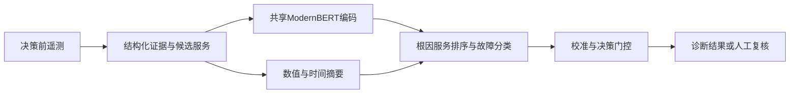

# DecisionOS-SRE

Auditable microservice diagnosis with ModernBERT, grouped evaluation, and FastAPI.

微服务故障诊断研究型MVP：从决策前遥测预测根因服务和五类故障，输出诊断结果或转人工复核。`execution_scope: mvp`，不执行运维操作。

## 核心设计

- **一次共享编码、两个任务**：ModernBERT编码证据，融合数值和时间摘要，完成动态候选服务排序与故障分类。
- **可审计评测**：Evidence与gold隔离；按原始运行分组，分开模型验证、校准、门控选择及历史回归。
- **可追溯推理**：FastAPI接口、温度校准、低置信度复核、模型/数据/策略的SHA256版本绑定。
- **保留负结果**：验证改善但回归退步时保留原模型，配置、逐案例预测和失败结论均留存。



## 真实结果

| 项目 | 已执行结果与范围 |
|---|---|
| 数据 | RCAEval两个示例应用、五类受控故障，共400个原始案例；165条TRAIN中有效164条 |
| 工程验收 | 原14项MVP验收完成；原含数据环境最近97项测试通过 |
| 默认模型 | 第五轮temporal_seed44；原40例验证联合准确率92.5% |
| 未采用候选 | 第十二轮40例验证达到95%，历史回归退步，未替换默认模型 |
| 最新开发评估 | 2种特征 × 3折 × 3个seed，共18次真实GPU训练；旧/新特征折外联合均值68.9%/72.4% |
| 波动 | 联合准确率seed间样本标准差2.20/6.69个百分点；尚不能认定稳定提升 |
| CPU实测 | 第十二轮候选，Ryzen 9 7945HX、CPU 8线程、batch=1，P95为871.0ms；不是默认模型的新测量或生产SLA |
| 新独立数据 | 审计94个外部事件，因采样和语义不符合准入，新增可用案例0条 |

联合准确率指根因服务和故障类别同时正确。开发CV只使用既有TRAIN，不能与默认模型40例验证值直接比较。历史集合经过多轮使用，不是新的独立确认。

- [第十二轮结果与MVP逐项验收](docs/round12_results.md)
- [第十三轮分组CV、错误审计和外部数据审计](docs/round13_results.md)
- [机器可读状态](outputs/round13/status.json)
- [工程选择与原因](docs/decisions.md)

## 从源码检查项目

源码包不含原始遥测、模型权重或虚拟环境。以下命令只安装依赖并运行测试，不下载预训练模型或开始训练。原验证环境为Windows / Python 3.13；项目声明Python >=3.11，其他平台仍需验证。可通过Git克隆或GitHub的Download ZIP取得源码。需要历史提交核验时应完整克隆：

```powershell
git clone https://github.com/TSU333/DecisionOS-SRE.git
cd DecisionOS-SRE
```

在仓库根目录运行：

```powershell
python -m venv .venv
.\.venv\Scripts\python.exe -m pip install torch==2.7.1 --index-url https://download.pytorch.org/whl/cpu
.\.venv\Scripts\python.exe -m pip install -e . pytest==8.3.5 httpx==0.28.1
.\.venv\Scripts\python.exe -m pytest -q
.\.venv\Scripts\python.exe -m decisionos_sre --help
```

本次不含数据和权重的源码副本实测92项通过、5项跳过，CLI帮助正常；使用原已安装环境，未重新安装依赖。缺少本地数据时，5项真实数据集成检查会明确跳过；其余小模型/fixture测试检查工程正确性，不生成正式实验指标。首次从公共包索引安装整套依赖的过程尚未在新的干净机器上复测。

## 训练与复现

`scripts/setup.ps1`面向Windows/CUDA，会安装依赖并下载固定版本ModernBERT；`scripts/reproduce.ps1`下载初始125例子集并执行基线、冻结头、SFT及评测。这个初始流程不会直接复现第十三轮结果。

最终默认模型与后续实验依赖逐轮形成的数据、父模型及封存Git版本。源码ZIP不包含这些产物，也不含Git历史；下载源码不等于获得可立即推理的最终模型。具体入口及依赖见[本地运行记录](docs/local_runbook.md)和[发布与复现说明](docs/github_release.md)。

已有完整本地产物时，在仓库根目录启动默认模型：

```powershell
$env:PYTHONPATH='src'
.\work\.venv\Scripts\python.exe -m decisionos_sre serve --artifact artifacts/round5/temporal_seed44/frozen --port 8000
```

## API

| 接口 | 用途 |
|---|---|
| `GET /health` | 进程存活检查 |
| `GET /ready` | 模型加载状态，缺少工件返回503 |
| `POST /v1/decide` | 接收IncidentInput，返回根因、故障、复核策略和版本信息 |

输入结构见[schema.py](src/decisionos_sre/schema.py)。接口拒绝gold训练标签、未来证据等无效输入；缺模型时不会回退随机权重。

## 目录

```text
src/decisionos_sre/  数据、序列化、模型、训练、评测与API
configs/            固定实验配置
scripts/            下载、复现、审计与报告入口
tests/              正确性与异常边界测试
docs/               数据审计、实验协议、决策与结果
outputs/            已保存的机器结果、预测、日志与图表
```

## 适用范围与许可

实验使用已知注入起点、300秒基线和60秒观测；没有验证生产故障检测、未知环境泛化或自动处置。默认路径主要使用指标，调用链仅在部分实验中启用，日志未接入。没有宣称生产上线、强化学习、从零预训练基础模型或95%的通用准确率。

代码采用[MIT许可](LICENSE)。数据、预训练模型和依赖各自遵循上游许可，见[第三方来源说明](THIRD_PARTY_NOTICES.md)。原始遥测与权重不随仓库分发。
